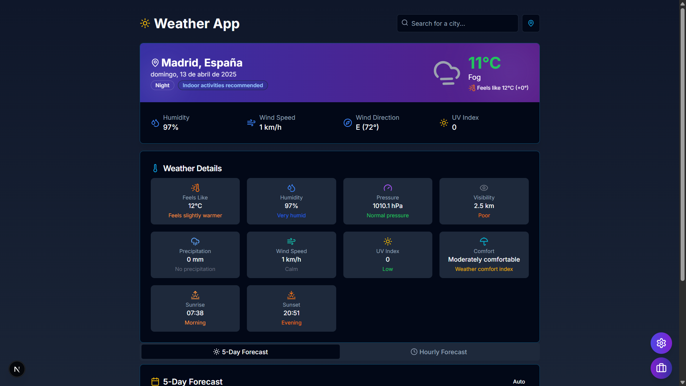

# 🌤️ Modern Weather App



A modern, responsive weather application built with Next.js and TypeScript that provides real-time weather data and forecasts.

## ✨ Features

- 🌡️ Real-time weather data and forecasts
- 🔍 Location-based search
- 📍 Geolocation support
- 📱 Responsive design
- 🌓 Dark/Light theme
- ⚡ Loading states and error handling

## 🛠️ Tech Stack

- ⚛️ Next.js 15.2
- 📝 TypeScript
- 🎨 Tailwind CSS
- 🎯 shadcn/ui
- 🎭 Lucide React
- 🔔 Sonner

## 🚀 Getting Started

### Prerequisites

- Node.js 18.17 or later
- pnpm (recommended) or npm

### Installation

```bash
git clone https://github.com/EduardoProfe666/weather-app.git
cd weather-app
pnpm install
pnpm dev
```

The application will be available at `http://localhost:3000`

## 🤝 Contributing

1. Fork the repository
2. Create your feature branch (`git checkout -b feature/NewFeature`)
3. Commit your changes (`git commit -m 'Add NewFeature'`)
4. Push to the branch (`git push origin feature/NewFeature`)
5. Open a Pull Request

## 📄 License

This project is licensed under the MIT License - see the [LICENSE](LICENSE) file for details.

---

Developed with ❤️ by EduardoProfe666
